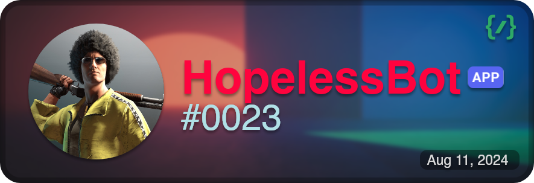

# ‼️ On Hold For Next Few Months ‼️

> **IMPORTANT**: This is the **_rebuild_** branch. It represents a new version of the bot with a new structure and classes to implement advanced and some legacy features from [Node](https://github.com/theassassin0128/Node). The code here may change or get updated without notice. Until next time, **Goodbye**.

[![Version][version-shield]][version-shield-link]
[![Contributors][contributors-shield]][contributors-url]
[![Forks][forks-shield]][forks-url]
[![Stargazers][stars-shield]][stars-url]
[![Issues][issues-shield]][issues-url]
[![Support Server][support-shield]][support-server]
[![MIT License][license-shield]][license-url]
[![CodeQL][codeql]][codeql-url]
[![Dependency Review][dependency-review]][dependency-review-url]
[![CodeFactor][code-factor]][code-factor-url]

## Introduction

**Hopeless Bot** is a multipurpose Discord bot, specially made for **Moderation** & **Server-Management**. It is built with [discord.js](https://github.com/discordjs/discord.js), a powerful [Node.js](https://nodejs.org) module that allows you to easily interact with the [Discord API](https://discord.com/developers/docs/intro).

[✉️ Invite Hopeless Bot](https://discord.com/oauth2/authorize?client_id=1272259032098275358) • [🆘 Support Server](https://discord.gg/E6H9VvBdTk) • [📝 Bug & Request Feature](https://github.com/theassassin0128/Hopeless-Bot/issues)

## 📊 Road Map

- [x] **Basic Bot**
- [ ] **Advanced Bot**
- [ ] **Documentation**
- [ ] **Moderation Bot**
- [x] **Music Bot** _(basic version)_
- [ ] **Web-based Dashboard**
- [x] **Website** _(simple)_

## 💡 Features

1. **Advanced Logger**
2. **Moderation Tools**
3. **Music Streaming**
4. **Server Management**
5. **Custom Commands**
6. **Web Dashboard** (planned)

## Contributing

Contributions are welcome! Please check the [issues page](https://github.com/theassassin0128/Hopeless-Bot/issues) for open issues and feature requests.

## License

This project is licensed under the MIT License. See the [LICENSE](LICENSE) file for details.

[version-shield]: https://img.shields.io/github/package-json/v/theassassin0128/Hopeless-Bot
[version-shield-link]: https://github.com/theassassin0128/Hopeless-Bot
[contributors-shield]: https://img.shields.io/github/contributors/theassassin0128/Hopeless-Bot
[contributors-url]: https://github.com/theassassin0128/Hopeless-Bot/graphs/contributors
[forks-shield]: https://img.shields.io/github/forks/theassassin0128/Hopeless-Bot
[forks-url]: https://github.com/theassassin0128/Hopeless-Bot/network/members
[stars-shield]: https://img.shields.io/github/stars/theassassin0128/Hopeless-Bot
[stars-url]: https://github.com/theassassin0128/Hopeless-Bot/stargazers
[issues-shield]: https://img.shields.io/github/issues/theassassin0128/Hopeless-Bot
[issues-url]: https://github.com/theassassin0128/Hopeless-Bot/issues
[support-shield]: https://img.shields.io/discord/1054284394791178291?logo=discord&colorB=7289DA
[support-server]: https://discord.gg/E6H9VvBdTk
[license-shield]: https://img.shields.io/github/license/theassassin0128/Hopeless-Bot
[license-url]: https://github.com/theassassin0128/Hopeless-Bot/blob/main/LICENSE
[codeql]: https://github.com/theassassin0128/Hopeless-Bot/workflows/CodeQL/badge.svg
[codeql-url]: https://github.com/theassassin0128/Hopeless-Bot/actions?query=workflow%3ACodeQL
[dependency-review]: https://github.com/theassassin0128/Hopeless-Bot/workflows/Dependency%20Review/badge.svg
[dependency-review-url]: https://github.com/theassassin0128/Hopeless-Bot/actions?query=workflow%3A%22Dependency+Review%22
[code-factor]: https://img.shields.io/codefactor/grade/github/theassassin0128/Hopeless-Bot?logo=codefactor&logoColor=%23F44A6A
[code-factor-url]: https://www.codefactor.io/repository/github/theassassin0128/Hopeless-Bot
